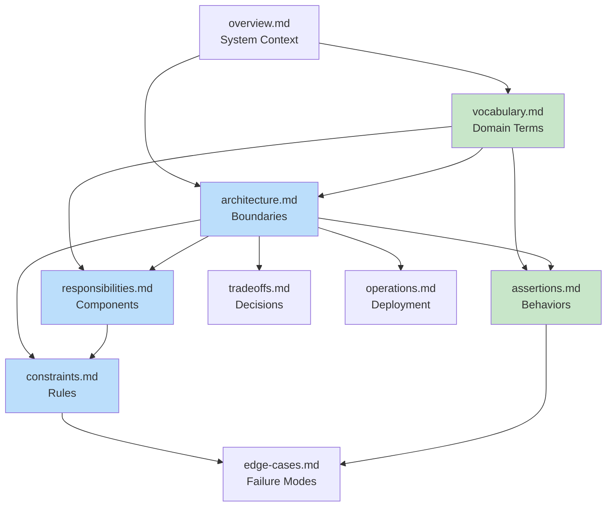

# GitHub Bot SDK - Architecture Specification

**Version**: 1.0
**Status**: Living Document
**Last Updated**: January 2026

## Purpose

This directory contains the architectural specifications for the GitHub Bot SDK. These documents define the logical boundaries, responsibilities, constraints, and behavioral requirements that guide implementation.

## For Architects

If you're reviewing or evolving the architecture:

1. Start with [overview.md](overview.md) - System context and goals
2. Review [vocabulary.md](vocabulary.md) - Domain concepts and terminology
3. Study [architecture.md](architecture.md) - Logical boundaries and dependencies
4. Examine [responsibilities.md](responsibilities.md) - Component responsibilities (RDD)
5. Understand [constraints.md](constraints.md) - Implementation rules and boundaries

## For Interface Designers

When translating architecture to concrete interfaces:

1. Architecture specs define **what and why** (logical design)
2. You define **how and where** (concrete types, file organization)
3. Use [vocabulary.md](vocabulary.md) for naming concepts
4. Follow [constraints.md](constraints.md) for rules
5. Reference [assertions.md](assertions.md) for behaviors to implement
6. Output goes to [interfaces/](interfaces/) directory

## For Implementers

When writing code:

1. Reference [interfaces/](interfaces/) for concrete type signatures
2. Use [assertions.md](assertions.md) as test specifications
3. Follow [constraints.md](constraints.md) for implementation rules
4. Review [edge-cases.md](edge-cases.md) for scenarios to handle
5. Consult [operations.md](operations.md) for deployment considerations

## For Operators

When deploying and maintaining:

1. Read [operations.md](operations.md) - Deployment patterns and monitoring
2. Review [edge-cases.md](edge-cases.md) - Failure modes and recovery
3. Check [tradeoffs.md](tradeoffs.md) - Understand architectural decisions

---

## Architecture Document Index

### Core Architecture Specifications

#### [overview.md](overview.md)

**System context, stakeholders, goals, and scope**

- Purpose and target users
- System boundaries and non-goals
- Design principles
- Quality attributes and success metrics

#### [vocabulary.md](vocabulary.md) ✅

**Domain concepts and terminology**

- GitHub integration concepts (App, Installation, Tokens)
- Event processing concepts (Envelope, Parsing, Sessions)
- Authentication concepts (JWT, Token Caching, Secrets)
- API client concepts (Rate Limiting, Pagination)
- **Status**: Well-defined, use as naming authority

#### [assertions.md](assertions.md) ✅

**Testable behavioral requirements**

- Authentication behaviors (JWT, tokens, caching)
- API operation behaviors (repositories, issues, PRs)
- Webhook processing behaviors (validation, parsing)
- Given/When/Then format for test implementation
- **Status**: Comprehensive, use as test specifications

#### [architecture.md](architecture.md)

**Logical boundaries and dependencies**

- Core domain layers (Authentication, Events, API Operations)
- Abstraction interfaces (AuthProvider, ApiClient, SecretProvider)
- Dependency flow rules (inward dependencies only)
- Error handling architecture
- Testing strategy

#### [responsibilities.md](responsibilities.md)

**Component responsibilities using RDD**

- What each component knows
- What each component does
- How components collaborate
- Roles in the system

#### [constraints.md](constraints.md)

**Implementation rules and boundaries**

- Type system constraints (branded types, error handling)
- Security constraints (token handling, cryptography)
- Async constraints (tokio, cancellation)
- Boundary constraints (what depends on what)

---

### Supporting Architecture Documents

#### [tradeoffs.md](tradeoffs.md)

**Architectural decisions and alternatives analysis**

- Key decisions made (language, authentication model, abstractions)
- Alternatives considered for each decision
- Tradeoff analysis and rationale
- Future decisions to consider

#### [operations.md](operations.md)

**Deployment and operational considerations**

- Deployment patterns (serverless, long-running, worker)
- Monitoring and observability requirements
- Scaling considerations (horizontal and vertical)
- Reliability and resilience strategies
- Configuration management
- Disaster recovery procedures

#### [edge-cases.md](edge-cases.md)

**Non-standard flows and failure modes**

- Authentication edge cases (clock skew, key formats, token expiration)
- API client edge cases (rate limits, pagination, retries)
- Webhook processing edge cases (duplicates, ordering, malformed data)
- Concurrency edge cases (thundering herd, shutdowns)
- Recovery strategies and test recommendations

---

### Detailed Architecture Explorations

#### [architecture/app-level-authentication.md](architecture/app-level-authentication.md)

Deep dive into app-level vs installation-level authentication patterns

#### [architecture/integration.md](architecture/integration.md)

Integration patterns with external systems and services

#### [architecture/security.md](architecture/security.md)

Security architecture, threat model, and mitigations

---

### Interface Specifications

#### [interfaces/README.md](interfaces/README.md)

**Concrete type signatures and API contracts**

- Interface designer's output
- Translates architecture to Rust traits and types
- Organized by functional area
- Includes all concrete type signatures

**Interface documents**:

- [installation-client.md](interfaces/installation-client.md) - Client foundation
- [repository-operations.md](interfaces/repository-operations.md) - Repository API
- [issue-operations.md](interfaces/issue-operations.md) - Issue, comment, assignee, label, lock, milestone, timeline API
- [reactions.md](interfaces/reactions.md) - Emoji reactions on issues and comments
- [pull-request-operations.md](interfaces/pull-request-operations.md) - Pull request API
- [project-operations.md](interfaces/project-operations.md) - Project management API
- [pagination.md](interfaces/pagination.md) - Pagination support
- [rate-limiting-retry.md](interfaces/rate-limiting-retry.md) - Rate limiting and retry
- [additional-operations.md](interfaces/additional-operations.md) - Workflows, releases

---

## Workflow: Architecture → Interface → Implementation

### Architect Mode (This Directory)

**Input**: Requirements, stakeholder needs
**Output**: Architecture specifications (this directory)
**Focus**: What and why (logical design)

**Produces**:

- System boundaries and responsibilities
- Domain vocabulary and concepts
- Behavioral assertions (testable requirements)
- Constraints and tradeoffs
- Edge cases and operational considerations

### Interface Designer Mode

**Input**: Architecture specifications
**Output**: Concrete interfaces in [interfaces/](interfaces/)
**Focus**: How and where (concrete types, organization)

**Produces**:

- Rust trait definitions
- Struct and enum types
- Function signatures
- Module organization
- Type constraints

### Planner Mode

**Input**: Interfaces + Architecture
**Output**: Task breakdown
**Focus**: Implementation sequence

**Produces**:

- Task dependencies
- Implementation order
- Testing strategy
- Review checkpoints

### Coder Mode

**Input**: Tasks + Interfaces + Assertions
**Output**: Implementation
**Focus**: Correct, tested code

**Produces**:

- Working implementation
- Unit and integration tests
- Documentation
- Examples

---

## Document Relationships



---

## Key Architectural Decisions

### Decision 1: Clean Architecture with Dependency Inversion

Core domain logic depends only on abstractions, never on infrastructure implementations. This enables testing and flexibility.

### Decision 2: Two-Level Authentication Model

Separate app-level (JWT) and installation-level (installation token) authentication to match GitHub's actual model.

### Decision 3: Trait-Based Abstractions

Use Rust traits for external dependencies (HTTP, secrets, tracing) to enable testing and deployment flexibility.

### Decision 4: Proactive Token Refresh

Refresh tokens 5 minutes before expiration to prevent operation failures and handle clock skew.

### Decision 5: Fully Async API

All I/O operations are async to support high-throughput webhook processing and concurrent operations.

### Decision 6: Security by Default

Webhook validation is mandatory, tokens are never logged, and cryptographic operations use constant-time comparison.

### Decision 7: Explicit Error Handling

All operations return `Result<T, E>` with structured error types. No panics in library code.

See [tradeoffs.md](tradeoffs.md) for detailed analysis of each decision.

---

## Design Principles

1. **Type Safety**: Use Rust's type system to prevent bugs
2. **Security by Default**: Security constraints are enforced, not optional
3. **Reliability First**: Designed for production high-availability workloads
4. **Observable Operations**: Built-in logging, tracing, and metrics
5. **Testable Architecture**: Clean abstractions enable comprehensive testing
6. **Async-First**: Non-blocking I/O throughout for high throughput

---

## Status and Maintenance

### Current Status

- ✅ Core architecture defined
- ✅ Vocabulary established
- ✅ Assertions documented
- ✅ Constraints specified
- ✅ Interface specifications complete
- 🔄 Implementation in progress (see [tasks.md](../../.llm/tasks.md))

### Maintenance

This is a **living document**. As the SDK evolves:

- Update specifications to reflect learning
- Document new architectural decisions in [tradeoffs.md](tradeoffs.md)
- Add discovered edge cases to [edge-cases.md](edge-cases.md)
- Refine constraints based on implementation experience

### Feedback Loop

```
Implementation → Learning → Specification Updates → Better Implementation
```

---

## Questions?

- **Architectural questions**: Review [tradeoffs.md](tradeoffs.md) for decision rationale
- **Implementation questions**: Check [interfaces/](interfaces/) for concrete contracts
- **Operational questions**: See [operations.md](operations.md) for deployment guidance
- **Testing questions**: Use [assertions.md](assertions.md) as test specifications
