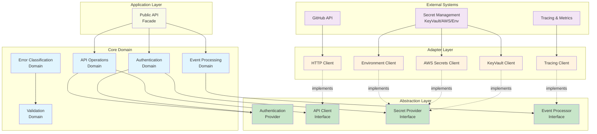

# GitHub Bot SDK Architecture

## Purpose

This document defines the logical architecture of the GitHub Bot SDK, establishing clear boundaries between core domain logic and external dependencies. The architecture follows clean architecture principles with strict dependency inversion.

## Architectural Principles

### 1. Dependency Inversion

**Core domain depends only on abstractions, never on infrastructure**

```
External Systems
    ↓ (implements)
Adapters/Clients
    ↓ (implements)
Abstraction Interfaces (Traits/Ports)
    ↑ (depends on)
Core Domain Logic
    ↑ (orchestrates)
Application Layer
```

### 2. Separation of Concerns

- **Business logic** is isolated from infrastructure details
- **Domain concepts** are expressed in GitHub vocabulary, not technical terms
- **External dependencies** are behind abstract interfaces
- **Testing** is possible without real external systems

### 3. Explicit Boundaries

Every layer has clear responsibilities and communication contracts.

---

## Architecture Overview



---

## Core Domain Layer

The heart of the SDK containing GitHub integration business logic, independent of infrastructure.

### Authentication Domain

**Responsibility**: Manage GitHub App authentication lifecycle

**What it Knows**:

- GitHub App identity (App ID)
- Installation mappings
- Token lifecycle rules
- Authentication state validity

**What it Does**:

- Generates JWT tokens for app-level authentication
- Exchanges JWTs for installation tokens
- Manages token lifecycle with proactive refresh
- Validates authentication state
- Caches tokens securely

**Domain Rules**:

1. JWTs expire within 10 minutes (GitHub requirement)
2. Installation tokens refreshed 5 minutes before expiration
3. Private keys never exposed in logs or errors
4. Token cache respects TTL and security constraints
5. Authentication failures classified for retry decisions

**Dependencies (Abstractions Only)**:

- Authentication Provider (for cryptographic operations)
- Secret Provider (for private key retrieval)

---

### Event Processing Domain

**Responsibility**: Convert and validate GitHub webhooks into domain events

**What it Knows**:

- GitHub event types and structures
- Webhook signature validation rules
- Event correlation strategies
- Session identification logic

**What it Does**:

- Validates webhook HMAC signatures
- Parses JSON payloads into typed events
- Extracts session IDs for ordering
- Enriches events with metadata
- Preserves original payload for debugging

**Domain Rules**:

1. All webhooks validated before processing
2. Unknown event types handled gracefully
3. Session IDs deterministic for related events
4. Original payload always preserved
5. Trace context propagated for observability

**Dependencies (Abstractions Only)**:

- Event Processor (for signature validation)
- Validation Domain (for input validation)

---

### API Operations Domain

**Responsibility**: Provide type-safe GitHub API access with error handling

**What it Knows**:

- GitHub API operation semantics
- App-level vs installation-level operation boundaries
- Rate limit constraints
- Retry eligibility rules

**What it Does**:

- Constructs authenticated API requests
- Selects appropriate authentication level (app/installation)
- Handles pagination for list operations
- Manages rate limiting with backoff
- Parses and validates API responses
- Classifies errors for retry decisions

**Domain Rules**:

1. App-level operations use JWT authentication
2. Installation operations use installation tokens
3. Rate limits respected with exponential backoff
4. Request failures classified (transient vs permanent)
5. Responses validated before returning to caller
6. Pagination handled transparently

**Dependencies (Abstractions Only)**:

- API Client (for HTTP operations)
- Authentication Provider (for tokens)
- Error Domain (for classification)

---

### Error Classification Domain

**Responsibility**: Categorize errors for handling strategies

**What it Knows**:

- Error type classifications
- Retry eligibility rules
- GitHub error code meanings
- Error severity levels

**What it Does**:

- Classifies errors as transient or permanent
- Determines retry eligibility and timing
- Preserves error context for debugging
- Ensures no sensitive data in error messages
- Assesses severity for alerting

**Domain Rules**:

1. Consistent classification across operations
2. No sensitive information in error messages
3. Sufficient context for debugging
4. Unknown errors default to transient with limits
5. Security errors logged for monitoring

---

### Validation Domain

**Responsibility**: Validate all external inputs

**What it Knows**:

- Valid input formats
- Security constraints
- Configuration requirements

**What it Does**:

- Validates webhook payloads
- Validates configuration parameters
- Validates API request inputs
- Enforces security constraints
- Provides clear error messages

**Domain Rules**:

1. All external input validated before use
2. Clear, actionable validation errors
3. Security constraints enforced consistently
4. Invalid input never causes panics
5. Validation logic centralized and reusable

---

## Abstraction Layer (Interfaces/Traits/Ports)

Contracts between domain logic and infrastructure, enabling dependency inversion and testing.

### Authentication Provider

**Contract**: Manages authentication token lifecycle

**Operations**:

- Generate app-level JWT token
- Exchange JWT for installation token
- Refresh installation token
- Check token expiration status

**Requirements**:

- Thread-safe async operations
- Immutable tokens after creation
- Refresh preserves metadata
- Expiration checks account for clock skew

**What it Does NOT Specify**:

- Cryptographic algorithm details
- Token storage mechanism
- Private key format
- Caching strategy

---

### API Client

**Contract**: Execute authenticated HTTP requests to GitHub API

**Operations**:

- Execute single request
- Execute paginated request series
- Provide rate limit status

**Requirements**:

- Graceful timeout and network failure handling
- Transparent rate limiting
- Type-safe response parsing
- Automatic pagination when requested

**What it Does NOT Specify**:

- HTTP library used
- Connection pooling strategy
- TLS certificate validation
- Proxy configuration

---

### Secret Provider

**Contract**: Retrieve secrets securely

**Operations**:

- Get secret by key
- Refresh secret value
- Provide cache duration

**Requirements**:

- Secrets never logged
- Resilient to service outages
- Support secret rotation
- Balance security and performance

**What it Does NOT Specify**:

- Secret storage backend
- Authentication mechanism
- Encryption at rest
- Access control implementation

---

### Event Processor

**Contract**: Process GitHub webhooks

**Operations**:

- Validate webhook signature
- Process webhook into event
- Extract event metadata

**Requirements**:

- Deterministic and idempotent processing
- Constant-time signature comparison
- Preserve unknown fields (forward compatibility)
- Consistent metadata extraction

**What it Does NOT Specify**:

- Signature algorithm details
- JSON parsing library
- Event storage mechanism
- Routing logic

**Implementation Note**: In SDK context, EventProcessor is implemented as a concrete struct rather than a trait. This is acceptable for library SDKs where webhook validation logic is deterministic and doesn't require runtime polymorphism. The architecture specifies the contract and behavior; trait-based abstraction is optional based on flexibility needs.

---

## Adapter Layer (Infrastructure Implementations)

Concrete implementations of abstractions, handling integration with real systems.

### Purpose

Adapters translate between domain contracts and actual external systems.

### Characteristics

- Implement abstraction interfaces
- Contain NO business logic
- Handle infrastructure-specific details
- Manage external system peculiarities
- Provide error translation

### Adapter Layer in SDK Context

For library SDKs where HTTP client integration is deterministic and doesn't need runtime swapping, adapters may be embedded within domain modules rather than strictly separated. This is a pragmatic decision that:

1. Reduces unnecessary indirection for stable dependencies
2. Simplifies the public API surface
3. Maintains testability through trait abstractions where needed
4. Preserves clean architecture principles at logical level

The key architectural principle remains: **domain logic must not depend on concrete infrastructure implementations** for operations that may vary or require testing flexibility.

### Examples

**HTTP Client Adapter**:

- Implements API Client interface
- Uses reqwest or similar HTTP library
- Handles GitHub API specifics (headers, error codes)
- Manages connection pooling
- Translates HTTP errors to domain errors

**Secret Management Adapters**:

- Azure Key Vault: Uses Azure SDK, Managed Identity auth
- AWS Secrets Manager: Uses AWS SDK, IAM role auth
- Environment Variables: Reads from process environment

**Telemetry Adapters**:

- OpenTelemetry: Distributed tracing integration
- Structured Logging: Integration with tracing crate
- Metrics: Integration with metrics crate

---

## Application Layer

The public API surface that orchestrates domain operations.

### Purpose

Provide convenient, high-level API for bot developers while hiding internal complexity.

### Characteristics

- Composes domain objects
- Manages dependency injection
- Handles cross-cutting concerns
- Provides builder patterns
- Offers convenience methods

### Responsibilities

- Assemble dependencies at runtime
- Route requests to appropriate domain
- Handle cross-domain workflows
- Provide ergonomic API
- Document usage patterns

---

## Dependency Flow Rules

### Rule 1: Inward Dependencies Only

```
External Systems → Adapters → Interfaces ← Domain ← Application
```

**Enforcement**:

- Core domain NEVER imports adapter modules
- Core domain NEVER imports external system SDKs
- Interfaces defined IN or NEAR domain modules
- Adapters import interfaces, not vice versa

### Rule 2: Business Logic in Domain Only

- Adapters contain NO decision logic
- Adapters translate, don't transform business meaning
- Domain makes all business decisions

### Rule 3: Interface Segregation

- Each interface focused on single responsibility
- Interfaces specific to domain needs
- No "kitchen sink" interfaces

### Rule 4: Explicit Injection

- No global state
- No service locators
- Dependencies passed explicitly
- Constructor injection preferred

---

## Testing Strategy

### Unit Testing

**Test**: Core domain logic
**With**: Mock implementations of interfaces
**Verify**: Business rules and domain logic

### Integration Testing

**Test**: Adapter implementations
**With**: Real or test external systems
**Verify**: Integration contracts honored

### Contract Testing

**Test**: Interface implementations
**With**: Contract test suite
**Verify**: All adapters satisfy interface requirements

### End-to-End Testing

**Test**: Full system
**With**: Test GitHub App and repository
**Verify**: Real-world scenarios work

---

## Module Organization Principles

**Important**: This architecture specifies LOGICAL boundaries, not physical file structure.

### Logical Organization

- **Domain concepts** grouped by responsibility (auth, events, api)
- **Abstractions** defined with or near domain logic
- **Adapters** separated from domain

### Shared Domain Types

Some types represent GitHub API entities and are shared across multiple domains. These types are part of the "shared kernel" pattern:

**Repository, Issue, PullRequest**: GitHub API entity types

- **Location**: Defined in client module (owns GitHub API entity definitions)
- **Usage**: May be imported by other domains (events, webhooks)
- **Rationale**: These are pure data types with no business logic, representing GitHub's domain model
- **Pattern**: Shared Kernel - acceptable cross-domain dependency for common vocabulary

This cross-domain import is intentional and doesn't violate clean architecture because:

1. Types contain no business logic or behavior
2. They represent external system contracts (GitHub API)
3. Changes to these types reflect GitHub API changes, not internal design decisions

### Physical Organization (Interface Designer's Responsibility)

- File structure follows Rust conventions
- Module names use business domain language
- NO architectural terminology in code paths
- Organization optimized for Rust idioms

**Example of What NOT to Specify Here**:

```
src/
├── core/        # ❌ Don't prescribe "core" directory
├── ports/       # ❌ Don't prescribe "ports" directory
├── adapters/    # ❌ Don't prescribe "adapters" directory
```

**Interface Designer Will Decide**:

- Actual module structure
- File naming conventions
- Public/private API boundaries
- Re-export strategies

---

## Error Handling Architecture

### Layered Error Types

**Domain Errors**: Business-level failures

- AuthenticationError (invalid credentials, expired tokens)
- ApiError (rate limits, permissions)
- ValidationError (invalid input)
- EventError (parsing failures, signature mismatches)

**Infrastructure Errors**: System-level failures

- NetworkError (timeouts, connection failures)
- StorageError (secret retrieval failures)
- SerializationError (JSON parsing)

**Application Errors**: High-level SDK failures

- Wraps domain and infrastructure errors
- Provides user-facing context
- Includes recovery suggestions

### Error Classification

**Transient Errors**: Should retry

- Network timeouts
- Rate limiting (with backoff)
- Temporary GitHub service issues

**Permanent Errors**: Should NOT retry

- Authentication failures (invalid credentials)
- Authorization failures (insufficient permissions)
- Validation failures (malformed input)
- Not found (404) errors

### Error Context

- Correlation IDs for tracing
- Operation context for debugging
- NO sensitive data (tokens, keys)
- Recovery suggestions when applicable

---

## Quality Attributes

### Security

- Secrets never in logs or errors
- Constant-time cryptographic comparisons
- Mandatory webhook validation
- Least-privilege API operations

### Reliability

- Proactive token refresh prevents failures
- Automatic retry with backoff
- Circuit breakers for cascading failures
- Graceful degradation

### Performance

- Token caching reduces API calls
- Connection pooling reuses connections
- Async I/O prevents blocking
- Efficient JSON parsing

### Observability

- Structured logging with correlation
- Distributed tracing support
- Rich error context
- Metrics for key operations

### Maintainability

- Clear separation of concerns
- Testable without external systems
- Well-documented abstractions
- Minimal cognitive load

---

## Future Architecture Considerations

### Potential Extensions

1. **GraphQL Support**: Add GraphQL client alongside REST
2. **Caching Layer**: Redis or distributed cache for multi-instance
3. **Event Streaming**: Support for event replay and streaming
4. **Batch Operations**: Optimize multiple related API calls
5. **GitHub Enterprise**: Enterprise-specific features

### Migration Paths

- New interfaces can be added without breaking existing
- Adapters can be swapped without domain changes
- Additional domains can be added following same patterns

---

## Summary

This architecture ensures:

1. **Business logic independence**: Core domain works regardless of infrastructure
2. **Testability**: Can test without real GitHub or external services
3. **Flexibility**: Swap adapters without changing domain
4. **Security**: Proper abstraction of sensitive operations
5. **Maintainability**: Clear boundaries and responsibilities
6. **Evolution**: Can add features without major refactoring

The key is **dependency inversion**: domain defines needs through interfaces, infrastructure provides implementations. This keeps GitHub integration logic clean, testable, and maintainable.
