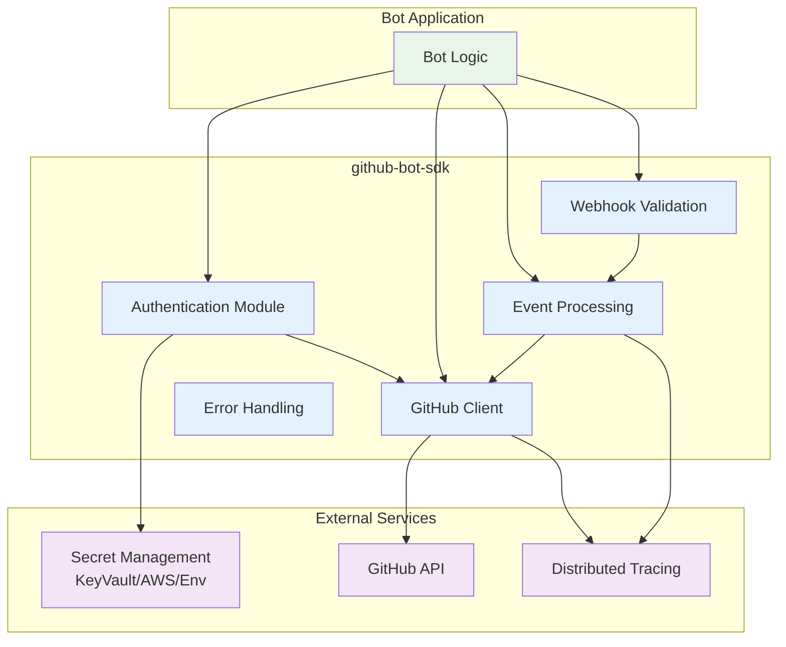

# GitHub Bot SDK - System Overview

## Purpose

The `github-bot-sdk` is a Rust library that provides a comprehensive foundation for building GitHub Apps and bots. It abstracts the complexity of GitHub App authentication, webhook validation, API interactions, and event processing into a clean, type-safe interface suitable for production deployments.

## Target Users

- **Bot Developers**: Building GitHub Apps for automation, CI/CD, project management
- **Platform Engineers**: Deploying reliable, scalable GitHub integration infrastructure
- **Security Teams**: Requiring type-safe, auditable GitHub API interactions

## System Context

## Core Stakeholders

### Bot Application Developers

**Needs**:

- Simple, type-safe API for GitHub operations
- Automatic authentication and token management
- Clear error handling and recovery
- Comprehensive documentation and examples

**Provided**:

- High-level client abstractions
- Automatic token refresh and caching
- Structured error types with context
- Testing utilities for mocking

### Infrastructure Operators

**Needs**:

- Observable, debuggable system
- Configuration management
- Deployment flexibility
- Operational metrics

**Provided**:

- Structured logging integration
- Distributed tracing support
- Multiple deployment patterns (serverless, long-running, worker)
- Health and readiness indicators

### Security Teams

**Needs**:

- Secure credential handling
- Webhook signature validation
- Audit trail for API operations
- No credential leakage in logs

**Provided**:

- Secure token storage with memory zeroing
- Mandatory webhook signature validation
- Redacted logging for sensitive data
- Integration with enterprise secret management

## Design Principles

### 1. Type Safety

Leverage Rust's type system to prevent integration errors at compile time:

- Branded types for identifiers (AppId, InstallationId, RepositoryId)
- Explicit error types with recovery information
- No `unsafe` code in library core
- Validated configuration types

### 2. Security by Default

Security constraints are enforced, not optional:

- Webhook signatures always validated
- Tokens never logged or exposed in errors
- Constant-time comparison for cryptographic operations
- Minimal permissions principle in API operations

### 3. Reliability First

Designed for production workloads with high availability requirements:

- Proactive token refresh prevents expiration failures
- Automatic retry with exponential backoff
- Circuit breakers for cascading failure prevention
- Rate limiting respects GitHub's infrastructure

### 4. Observable Operations

Built for operational visibility and debugging:

- Structured logging with correlation IDs
- Distributed tracing integration (OpenTelemetry compatible)
- Rich error context for troubleshooting
- Metrics for authentication, API calls, and webhooks

### 5. Testable Architecture

Clean abstractions enable comprehensive testing:

- Trait-based dependency injection
- Mock implementations for unit testing
- Test doubles for integration testing
- No hidden external dependencies

### 6. Async-First

Designed for high-throughput, concurrent operations:

- Fully async API using tokio runtime
- Non-blocking I/O throughout
- Cancellation token support
- Connection pooling and reuse

## Key Capabilities

### Authentication Management

- **GitHub App Authentication**: JWT generation with RSA signing
- **Installation Token Management**: Automatic exchange and refresh
- **Token Caching**: Performance optimization with security safeguards
- **Multi-Installation Support**: Handle multiple installations per app
- **Secret Provider Abstraction**: Azure Key Vault, AWS Secrets Manager, environment variables

### GitHub API Client

- **Authenticated Requests**: Automatic token injection
- **Operation Types**: Repository, issue, pull request, project, workflow, release
- **Rate Limiting**: Proactive throttling with margin-based protection
- **Retry Logic**: Exponential backoff for transient failures
- **Pagination Support**: Automatic handling of multi-page responses
- **App and Installation Context**: Support for both authentication levels

### Webhook Processing

- **Signature Validation**: HMAC-SHA256 verification with constant-time comparison
- **Event Parsing**: Type-safe parsing of GitHub webhook payloads
- **Event Envelope**: Normalized format with metadata and correlation
- **Session Management**: Ordered processing for related events
- **Idempotency**: Duplicate detection and handling

### Error Handling

- **Structured Errors**: Typed errors with recovery information
- **Transient vs Permanent**: Classification for retry decisions
- **Error Context**: Rich debugging information without sensitive data
- **Error Propagation**: Clean error chains using `thiserror`

## Non-Goals

This SDK explicitly does **not** provide:

- **GitHub Actions Runtime**: This is for GitHub Apps, not Actions
- **Git Operations**: No local git repository manipulation
- **GraphQL Client**: REST API only in current version
- **Event Storage**: No built-in event persistence or replay
- **Business Logic**: No opinionated workflows or automation logic
- **UI Components**: Backend library only

## Scope Boundaries

### In Scope

- GitHub App authentication and authorization
- GitHub REST API client operations
- Webhook signature validation and parsing
- Common GitHub entities (repos, issues, PRs, projects)
- Error handling and retry logic
- Rate limiting and throttling
- Testing utilities

### Out of Scope

- GitHub Actions-specific features
- Git protocol operations (clone, fetch, push)
- GraphQL API (future consideration)
- Webhook delivery infrastructure
- Long-term event storage
- Specific bot business logic
- GitHub Enterprise Server-specific features (current version)

### Future Considerations

- GraphQL API support for complex queries
- GitHub Enterprise Server specific features
- Advanced caching strategies (Redis, distributed)
- Webhook delivery retry infrastructure
- Pre-built bot workflow patterns
- Event streaming and replay capabilities

## Quality Attributes

### Performance Targets

- **Webhook Processing**: <500ms p95 end-to-end latency
- **JWT Generation**: <10ms p95
- **Installation Token Exchange**: <200ms p95
- **API Request Latency**: <1000ms p95 (GitHub dependent)
- **Token Cache Hit Rate**: >90% under normal load

### Reliability Targets

- **Library Stability**: No panics in normal operation
- **Error Recovery**: Automatic retry for transient failures
- **Token Availability**: >99.9% (with proactive refresh)
- **Rate Limit Compliance**: 100% adherence to GitHub limits

### Security Requirements

- **Credential Protection**: Zero credential exposure in logs/errors
- **Webhook Validation**: 100% signature verification
- **Timing Attack Prevention**: Constant-time cryptographic comparisons
- **Audit Trail**: Complete logging of authentication and API operations

### Maintainability Goals

- **Test Coverage**: >80% line coverage
- **Documentation**: 100% public API documented
- **Type Safety**: Zero `unsafe` in library code
- **Dependency Hygiene**: Minimal, audited dependencies

## Architecture Summary

The SDK follows a **clean architecture** with dependency inversion:

1. **Core Domain Layer**: Authentication, API operations, event processing (business logic)
2. **Abstraction Layer**: Traits defining contracts for external dependencies
3. **Adapter Layer**: Concrete implementations for HTTP, secrets, tracing
4. **Application Layer**: Public API surface and facades

**Key Principle**: Core domain depends only on abstractions, never on concrete external implementations.

See [architecture.md](architecture.md) for detailed architectural documentation.

## Getting Started Path

1. **Read Vocabulary**: Understand GitHub App concepts ([vocabulary.md](vocabulary.md))
2. **Review Constraints**: Learn implementation rules ([constraints.md](constraints.md))
3. **Check Assertions**: See behavioral requirements ([assertions.md](assertions.md))
4. **Study Architecture**: Understand boundaries and dependencies ([architecture.md](architecture.md))
5. **Review Interfaces**: Examine concrete API ([interfaces/README.md](interfaces/README.md))
6. **Read Operations**: Learn deployment patterns ([operations.md](operations.md))

## Success Metrics

The SDK is successful when:

- Bot developers can implement GitHub integration in hours, not days
- Production deployments have zero credential exposure incidents
- Token refresh failures are eliminated through proactive refresh
- Rate limiting is automatic and transparent to bot logic
- Testing requires no real GitHub API access
- Operations teams have full visibility into GitHub interactions
